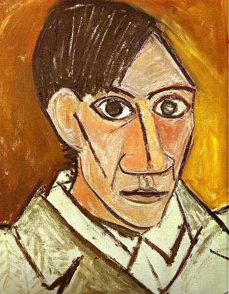

# Style-Transfer-karan

## Problem Statement 
- Objective is to apply the style of an image, which we will term as "style image" to a target image while preserving the content of the "target image". 

## Content Image - 

## Style Image - 

